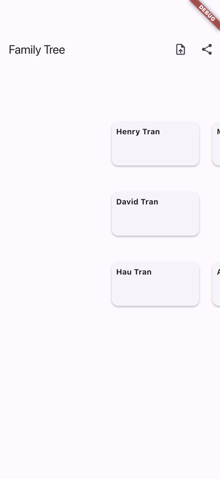

# flutter-genealogy-tree

Flutter cross-platform family tree / genealogy app. Manage a family tree, track lineage, import data from CSV / XLS / GEDCOM, share with relatives.

## Demo

Real captures from the iOS Simulator (see [FLOW.md](FLOW.md) for how they are generated).

| Family tree | Panned | Descendants |
|---|---|---|
|  |  |  |



## Features

- Family tree visualisation (multi-generation, pinch + pan)
- Person profile: name, birth, death, photo, notes, relationships
- Relationships: parent / spouse / child / sibling
- Import:
  - CSV (custom column mapping)
  - XLS / XLSX (via `excel` package)
  - GEDCOM 5.5.1 (standard genealogy format)
- Export back to CSV + GEDCOM
- Share-with-relatives flow: read-only invite link via Supabase Row Level Security
- Offline-first with Hive; sync queue when connection returns

## Architecture

```
lib/
  core/
    import/
      csv_importer.dart       # column mapping + validation
      xls_importer.dart       # excel sheet parser
      gedcom_parser.dart      # GEDCOM 5.5.1 reader
    tree/
      tree_layout.dart        # generation-based layout engine
      relationship_graph.dart # parent/child/spouse graph
      tree_painter.dart       # CustomPainter renderer
  features/
    tree/                     # zoomable tree screen
    person/                   # person detail + edit
    share/                    # invite relatives, view-only links
assets/
  samples/
    family.csv
    family.ged                # sample GEDCOM file
```

## Why GEDCOM matters

GEDCOM is the lingua franca of genealogy software (Ancestry, MyHeritage, FamilySearch). Supporting it means users can bring their data in, and take their data out. CSV/XLS only is a vendor-lock-in red flag for genealogy enthusiasts.

## Stack

- Flutter 3.24+, Dart 3.5+
- `flutter_riverpod` for state
- `hive` for offline storage
- `csv` + `excel` for tabular imports
- `supabase_flutter` for share-with-relatives
- `go_router` for routing
- Custom GEDCOM parser (no good Dart package exists; small footprint)
